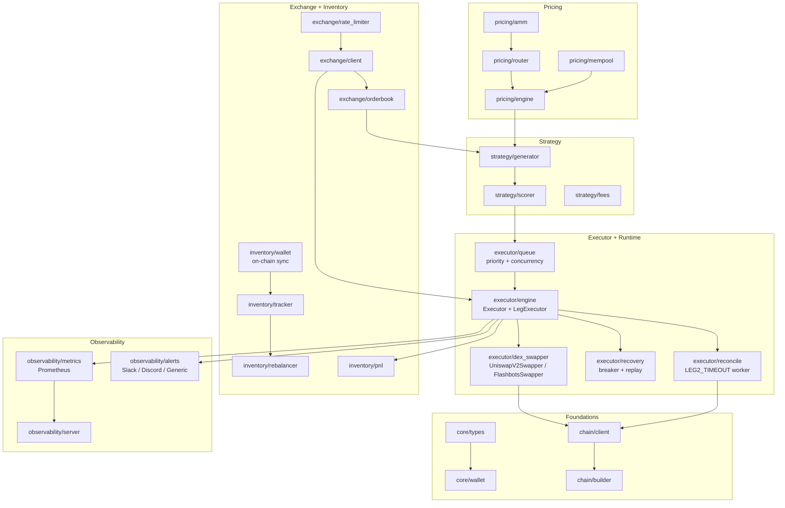
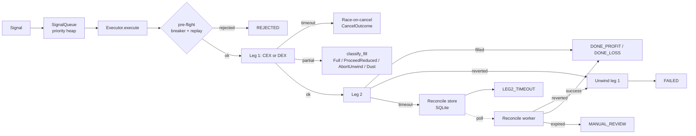

# Peanut Internship - Rust Project

An arbitrage detection and execution system spanning DEX (Uniswap V2) and CEX (Binance) venues, built entirely in Rust.

Scope covers the full pipeline: order-book + pool monitoring → signal generation and scoring → dual-leg execution (CEX-first or DEX-first) with timeouts, race-on-cancel, partial-fill handling, unwind, circuit breaker, persistent replay protection and reconciliation → Prometheus metrics and webhook alerts.

### Quick Start
1. `cp .env.example .env`
2. Fill in API keys in `.env`
3. `make run` (or `cargo run --bin arb_bot -- --simulation` for a safe dry run)
4. `make test`

### Environment
Exchange / chain basics:
- `PRIVATE_KEY`: hex-encoded Ethereum private key for local/testnet use
- `SEPOLIA_RPC_URL`: Sepolia RPC endpoint for integration work
- `MAINNET_RPC_URL`: optional mainnet RPC endpoint for analysis tooling
- `BINANCE_TESTNET_API_KEY` / `BINANCE_TESTNET_SECRET`: Binance testnet credentials

Live DEX execution (`arb_bot --dex-address-book ...`):
- `ETH_RPC_URL`: mainnet (or fork) RPC endpoint used by `UniswapV2Swapper`
- `WALLET_ADDRESS`: 0x-address that signs and receives DEX output
- `WALLET_PRIVATE_KEY`: signing key (env-var name is configurable via `--wallet-key-env`)
- `FLASHBOTS_AUTH_PRIVATE_KEY`: Flashbots relay auth signing key used when private DEX mode is enabled (env-var name is configurable via `--flashbots-auth-key-env`)

### Health Check
Run the environment and RPC checker before integration work:

`cargo run --bin check_env_and_rpc`

It verifies:
- wallet key is loadable
- derived wallet address
- Sepolia RPC connectivity, chain id, block height
- balance, pending nonce, and gas snapshot

### Integration Test
Full Sepolia lifecycle test — loads wallet, checks balance, builds a transfer,
estimates gas, signs, verifies signature locally, sends to testnet,
waits for confirmation, and analyzes the receipt:

```sh
cargo run --bin integration_test
```

Required env vars: `PRIVATE_KEY`, `SEPOLIA_RPC_URL`.
The wallet must hold at least **0.001 Sepolia ETH** (use https://sepoliafaucet.com).

### Analyzer CLI
Analyze any Ethereum transaction hash:

```sh
cargo run --bin analyzer -- <tx_hash> --rpc <url>
cargo run --bin analyzer -- <tx_hash> --format json
```

### Week 3: Exchange & Inventory CLIs

```sh
# Fetch and analyze order book
cargo run --bin orderbook_cli -- ETH/USDT --depth 20

# Check inventory skew and rebalance plans
cargo run --bin rebalancer_cli -- check
cargo run --bin rebalancer_cli -- plan ETH

# PnL summary dashboard
cargo run --bin pnl_cli

# End-to-end arbitrage check
cargo run --bin arb_checker_cli -- ETH/USDT --size 2.0
```

### Running `arb_bot`

`arb_bot` is the end-to-end runtime: it ticks the signal generator, scores opportunities, executes them via the dual-leg pipeline, persists state for reconciliation, and fans out metrics / alerts.

```sh
# Safe dry-run: stubbed DEX prices, simulated legs.
cargo run --bin arb_bot -- --simulation

# Live CEX + private DEX execution through Flashbots with persistent replay + reconcile.
cargo run --bin arb_bot -- \
    --pair ETH/USDC \
    --simulation false \
    --eth-rpc-url "$ETH_RPC_URL" \
    --wallet-address "$WALLET_ADDRESS" \
    --dex-address-book configs/address_book.json \
    --dex-slippage-bps 50 \
    --use-flashbots true \
    --flashbots-relay-url https://relay.flashbots.net \
    --flashbots-auth-key-env FLASHBOTS_AUTH_PRIVATE_KEY \
    --flashbots-target-block-offset 1 \
    --flashbots-max-blocks-to-try 3 \
    --require-private-dex true \
    --replay-db data/replay.db \
    --reconcile-db data/reconcile.db \
    --alert-webhook-url "$SLACK_WEBHOOK" --alert-provider slack \
    --metrics-port 9090 \
    --event-log-path logs/events.jsonl
```

Key flags:
- **`--simulation`** — in-process `SimulatedLegs`; never touches the exchange or chain.
- **`--dex-address-book <path>`** — JSON of `{pair: {base, base_decimals, quote, quote_decimals}}`; enables live DEX via `UniswapV2Swapper` or `FlashbotsSwapper`. Without it, live mode logs a warning and the DEX leg returns `NotImplemented`; in required private mode startup fails instead.
- **`--use-flashbots true|false`** — when true, live DEX uses `FlashbotsSwapper` and the executor runs DEX-first. When false, live DEX uses public mempool submission and the executor runs CEX-first.
- **`--flashbots-relay-url <url>`** — Flashbots-compatible relay endpoint. Defaults to `https://relay.flashbots.net`.
- **`--flashbots-auth-key-env <name>`** — environment variable containing the Flashbots relay auth private key. Defaults to `FLASHBOTS_AUTH_PRIVATE_KEY`.
- **`--flashbots-target-block-offset <n>`** — first target block offset from the current head. Defaults to `1`.
- **`--flashbots-max-blocks-to-try <n>`** — number of consecutive target blocks to submit the signed bundle for. Defaults to `3`.
- **`--require-private-dex true|false`** — when true, missing Flashbots auth or missing DEX address book is a startup error. Set false to allow fallback to public DEX / CEX-first mode.
- **`--replay-db <path>`** — SQLite journal so the signal-id replay window survives restarts (stretch S8).
- **`--reconcile-db <path>`** — SQLite store of `LEG2_TIMEOUT` entries. A background worker polls each entry's receipt, marks it `Resolved` / `Reverted` / `Expired`, and on revert fires `LegExecutor::unwind_position` to flatten leg 1 (stretch S3 + A2).
- **`--alert-webhook-url` / `--alert-provider`** — Generic, Slack, or Telegram adapter. The full URL is **never** logged — `mask_webhook_url` keeps only host + first path segment. Can also be set via `ALERT_WEBHOOK_URL`, `ALERT_PROVIDER`, and `ALERT_TELEGRAM_CHAT_ID`.
- **`--metrics-port`** — Prometheus exporter port (S7a). Set `0` to disable the HTTP endpoint. Scrape `http://<host>:<port>/metrics`.
- **`--event-log-path <path>`** — append-only JSONL observability log for daily reporting. Set empty to disable. Captures bot lifecycle, terminal executions, DEX pending timeout/cancel outcomes, and reconcile lifecycle events.

Flashbots behaviour:
- The private DEX swapper builds and signs the Uniswap V2 swap transaction locally, simulates it with `eth_callBundle`, then submits the raw signed transaction bundle with `eth_sendBundle`.
- The same signed transaction is submitted for `max_blocks_to_try` consecutive target blocks. If no receipt appears by the last target block or inclusion timeout, the DEX leg returns `BundleNotIncluded` and the executor treats the signal as rejected without opening the CEX leg.
- Allowance approval is still public-chain state. Ensure the wallet has sufficient allowance before relying on fully private swaps, or allow the bot to perform the approval transaction first.

Flashbots Prometheus metrics:
- `peanut_flashbots_simulations_total`
- `peanut_flashbots_bundles_submitted_total`
- `peanut_flashbots_bundles_included_total`
- `peanut_flashbots_bundles_not_included_total`
- `peanut_flashbots_bundle_simulation_seconds`
- `peanut_flashbots_bundle_inclusion_blocks`
- `peanut_flashbots_relay_errors_total`

Daily-report JSONL event types:
- `bot_started` / `bot_stopped`
- `execution_terminal`
- `dex_pending_timeout`
- `dex_cancel_outcome`
- `reconcile_enqueued`
- `reconcile_enqueue_failed`
- `reconcile_resolved`
- `reconcile_inspect_error`

Generate a daily report from the JSONL event log:

```sh
cargo run --bin daily_report -- \
    --events logs/events.jsonl \
    --trade-log trades.jsonl \
    --reconcile-db data/reconcile.db \
    --metrics-snapshot reports/metrics.prom \
    --compare-report reports/2026-05-06/daily.json \
    --date 2026-05-07 \
    --format markdown \
    --output reports/2026-05-07.md \
    --alert-summary-output reports/2026-05-07-alert.json \
    --alert-summary-format telegram \
    --alert-telegram-chat-id "$TELEGRAM_CHAT_ID"

cargo run --bin daily_report -- --events logs/events.jsonl --format json
cargo run --bin daily_report -- --events logs/events.jsonl --format csv --output reports/latest.csv
cargo run --bin daily_report -- --events logs/events.jsonl --format html --output reports/latest.html
cargo run --bin daily_report -- --events logs/events.jsonl --fail-on-health yellow --output reports/latest.md
```

The report summarizes bot lifecycle, terminal executions, realized PnL from `execution_terminal`, optional trade-log PnL from `ArbRecord` JSONL, DEX pending timeout/cancel safety, reconcile outcomes, optional reconcile DB open/manual-review entries, optional Prometheus text snapshots for Flashbots/DEX/reconcile counters, a numeric `risk_score`, and top risk causes. Output formats are Markdown, JSON, CSV, and standalone HTML. Use `--compare-report reports/YYYY-MM-DD/daily.json` for day-over-day deltas, `--alert-summary-output alert.json` to write a compact alert payload for external notifiers, and `--fail-on-health yellow` or `--fail-on-health red` in cron/CI jobs to exit with status `2` after writing the report when the health threshold is met.

`--alert-summary-format structured` writes the structured daily alert summary and includes a nested `telegram_payload`. `--alert-summary-format telegram` writes a Telegram Bot API `sendMessage` JSON body directly: `{ "chat_id": "...", "text": "...", "parse_mode": "HTML", "disable_web_page_preview": true }`. Pair it with `--alert-telegram-chat-id` or `TELEGRAM_CHAT_ID`, then post it to the existing Telegram webhook URL from a separate notifier job.

For a repeatable archive workflow that captures metrics and writes Markdown, JSON, and HTML artifacts under `reports/YYYY-MM-DD/`, use `.windsurf/workflows/daily-report.md`.

### Live readiness pre-flight

Before switching from simulation/dry-run to live execution, run the read-only readiness checker:

```sh
cargo run --bin live_readiness -- \
    --config configs/address_book_arbitrum.json \
    --reconcile-db data/reconcile.db \
    --events logs/events.jsonl \
    --metrics-snapshot reports/latest/metrics.prom \
    --eth-rpc-url "$ETH_RPC_URL" \
    --wallet-address "$WALLET_ADDRESS" \
    --simulation=false \
    --dry-run=false \
    --max-gas-gwei 1 \
    --format markdown
```

`live_readiness` validates address-book router/token/pool sanity, expected chain id, RPC health, wallet native/ERC-20 balances, token allowances to the configured router, reconcile DB open entries, recent observability events, selected Prometheus metrics, halt file state, and live risk caps. It only uses read-only RPC calls and exits with status `2` when any check is `FAIL` unless `--no-fail` is set. If RPC or wallet inputs are omitted, live chain/balance/allowance checks are marked `SKIP` while local config, DB, event, metrics, and risk checks still run. A missing event log is a `WARN` for fresh deployments; `simulation=true` is a `FAIL` because the checker is intended to gate live readiness, so pass `--simulation=false` for the final pre-live run. For a repeatable checklist, use `.windsurf/workflows/live-readiness.md`.

The bot respects a circuit breaker (N failures in a rolling window → cool-off), a replay window that REJECTS duplicate signal ids, and a configurable `max_concurrent_executions` cap. A `ctrl-c` cleanly shuts down the reconcile worker loop.

### Architecture



Execution pipeline (per signal):


### Repository Architecture
- `src/core/`: Base types (Address, TokenAmount, Token), WalletManager, CanonicalSerializer
- `src/chain/`: ChainClient (RPC + retry), TransactionBuilder, Flashbots relay client, TransactionAnalyzer
- `src/pricing/`: AMM math, router, mempool monitor, fork simulator, pricing engine
- `src/exchange/`: Binance client, order book analyzer, rate limiter, price oracle
- `src/inventory/`: Position tracker, rebalance planner, PnL engine, on-chain wallet sync
- `src/strategy/`: Signal generator (from venue prices), scorer (weighted 4-component), fee model
- `src/executor/`: Queue (priority), `Executor` state machine, `LegExecutor` trait with `SimulatedLegs` / `LiveLegs`, `UniswapV2Swapper`, `FlashbotsSwapper`, circuit breaker, replay protection, reconciliation worker
- `src/observability/`: Prometheus metrics exporter, webhook alert sinks (Generic / Slack / Discord)
- `src/integration/`: `ArbChecker` — end-to-end arbitrage pipeline helper
- `src/bin/`: CLI binaries (`arb_bot`, `orderbook_cli`, `pnl_cli`, `analyzer`, `integration_test`, etc.)
- `tests/`: Unit and integration tests
- `scripts/`: Automation scripts
- `configs/`: Non-secret configuration
- `docs/`: Module technical guides

### Module Details

#### exchange/
| File | Purpose |
|------|---------|
| `config.rs` | Venue configuration (Binance/Bybit) from env vars |
| `client.rs` | REST API client (order book, balance, orders, fees) |
| `binance.rs` | Binance-specific adapter for market data and trading |
| `bybit.rs` | Bybit-specific adapter for market data and trading |
| `orderbook.rs` | Walk-the-book, depth analysis, spread, imbalance |
| `rate_limiter.rs` | Token-bucket rate limiter (core cross-cutting concern) |
| `types.rs` | OrderBookSnapshot, OrderResult, NormalizedBalance, etc. |
| `errors.rs` | ExchangeError enum |

#### inventory/
| File | Purpose |
|------|---------|
| `tracker.rs` | Multi-venue position tracking, can_execute, skew detection |
| `rebalancer.rs` | Threshold-based rebalance planning with fee accounting |
| `pnl.rs` | Per-trade and aggregate PnL tracking, CSV export |
| `types.rs` | Venue enum, TransferPlan, fee constants |
| `errors.rs` | InventoryError enum |

#### pricing/
| File | Purpose |
|------|---------|
| `amm.rs` | Uniswap V2 math, reserves, and quote calculation |
| `v3/` | Uniswap V3 specialized math (ticks, liquidity, sqrt_price) |
| `router.rs` | Multi-hop route finding and comparison |
| `engine.rs` | High-level `PricingEngine` combining RPC and simulation |
| `mempool.rs` | Monitor and decode pending swaps for early arb detection |
| `simulator.rs` | `ForkSimulator` for zero-risk on-chain trade validation |
| `history.rs` | `HistoricalImpactAnalyzer` for backtesting price impact |
| `arb.rs` | `ArbDetector` — logic to find profitable CEX/DEX loops |

#### integration/
| File | Purpose |
|------|---------|
| `arb_checker.rs` | End-to-end arb check: DEX price + CEX book + inventory + costs |

#### strategy/
| File | Purpose |
|------|---------|
| `signal.rs` | `Signal` / `SignalParams`, direction, TTL, deterministic `signal_id` |
| `generator.rs` | `SignalGenerator` — converts venue prices into Signals, cooldown + inventory pre-filter |
| `scorer.rs` | 4-component weighted scorer (spread, liquidity, inventory, history) |
| `fees.rs` | Fee model shared between scoring and PnL |

#### executor/
| File | Purpose |
|------|---------|
| `engine.rs` | `Executor` state machine, `LegExecutor` trait (`SimulatedLegs`, `LiveLegs` with injected DEX swapper), CEX-first + Flashbots DEX-first flows, race-on-cancel, partial-fill classifier, unwind |
| `queue.rs` | Priority-scored `SignalQueue` + `QueueWorker` with `max_concurrent_executions` semaphore |
| `dex_swapper.rs` | `DexSwapper` trait + production `UniswapV2Swapper` and private `FlashbotsSwapper` (`ensure_allowance` + `swapExactTokensForTokens` via `TransactionBuilder`) |
| `recovery.rs` | `CircuitBreaker` + `ReplayProtection` (in-memory or SQLite-backed journal) |
| `reconcile.rs` | `ReconcileStore` (SQLite) + `ReconcileWorker` — receipt polling, async `spawn_blocking` I/O, transitions Pending→Resolved/Reverted/Expired |
| `errors.rs` | `ExecutorError`, `ExecutorResult` |

#### observability/
| File | Purpose |
|------|---------|
| `metrics.rs` | Prometheus counters / histograms (`init_metrics`, `metrics_handle`) |
| `events.rs` | Append-only JSONL event logger (`init_event_logger`, `emit_event`) for daily reports |
| `server.rs` | Hyper-based `/metrics` exporter (`serve_metrics`) |
| `alerts.rs` | `AlertEvent`, `AlertSink` (`Noop` / `Logging` / `Webhook`), provider adapters (Generic / Slack / Discord), `mask_webhook_url`, `evaluate_execution` rule engine |

#### bin/
| File | Purpose |
|------|---------|
| `daily_report.rs` | Daily operations report generator from JSONL observability events; supports Markdown, JSON, and CSV output |

#### safety/
| File | Purpose |
|------|---------|
| `limits.rs` | `RiskManager` — daily loss limits, max trade size, trade frequency |
| `validator.rs` | `PreTradeValidator` — sanity checks for prices and spreads |
| `killswitch.rs` | Watchdog file monitor for emergency manual halts |

### Generating Documentation

```sh
cargo doc --no-deps --open
```

### PricingEngine Example

```rust
use peanut_internship_rust::{Address, ChainClient, PricingEngine, Token};

#[tokio::main]
async fn main() -> Result<(), Box<dyn std::error::Error>> {
    let client = ChainClient::new(vec!["http://127.0.0.1:8545".into()], 10, 1);
    let mut engine = PricingEngine::new(
        client,
        "http://127.0.0.1:8545",
        "ws://127.0.0.1:8545",
    )?;

    let pools = vec![
        Address::new("0xB4e16d0168e52d35CaCD2c6185b44281Ec28C9Dc")?,
        Address::new("0x0d4a11d5EEaaC28EC3F61d100daF4d40471f1852")?,
    ];
    engine.load_pools(&pools).await?;

    let weth = Token {
        address: Address::new("0xC02aaA39b223FE8D0A0e5C4F27eAD9083C756Cc2")?,
        symbol: "WETH".into(),
        decimals: 18,
    };
    let usdc = Token {
        address: Address::new("0xA0b86991c6218b36c1d19D4a2e9Eb0cE3606eB48")?,
        symbol: "USDC".into(),
        decimals: 6,
    };

    let quote = engine
        .get_quote(
            &weth,
            &usdc,
            1_000_000_000_000_000_000,
            25,
            Address::new("0x00000000000000000000000000000000000000aa")?,
        )
        .await?;

    println!("Quote valid: {}", quote.is_valid());
    println!("Expected out: {}", quote.expected_output);
    println!("Simulated out: {}", quote.simulated_output);
    Ok(())
}
```

### Running Tests

```sh
# all tests
make test

# specific test suites
cargo test --test unit_core
cargo test --test unit_analyzer
cargo test --test unit_client
cargo test --test unit_builder
cargo test --test integration_wallet_security
cargo test --test integration_arb_flow   # Week 3 integration tests
```

### Test Coverage

**542 lib tests** (`cargo test --lib`), plus integration suites under `tests/`. Highlights:

- **core / chain / pricing**: address validation, wallet secrecy (Debug/Display never expose the private key), AMM math, router choice, fork-simulated quotes.
- **exchange / inventory**: order-book walking, spread/slippage, rate limiter, inventory skew + rebalance, PnL aggregation + CSV export.
- **strategy**: signal generation (direction / TTL / cooldown), weighted scoring, fee model.
- **executor**: full state machine (accepted → filled / rejected / failed / leg2_timeout / manual_review), race-on-cancel all branches, LEG1_PARTIAL classifier (Full / ProceedReduced / AbortUnwind / Dust), unwind on revert, Flashbots bundle target-block calculation, reconcile worker lifecycle (receipt success / revert / pending / expired / RPC error), SQLite persistence across reopens.
- **recovery**: circuit breaker open/close + cool-off, replay protection in-memory and journaled.
- **observability**: Prometheus counter increments including Flashbots lifecycle metrics, webhook URL masking (Slack / Discord / bad input), alert rule evaluation per terminal state.
- **property tests (proptest)**: AMM invariants, router net-math consistency.
