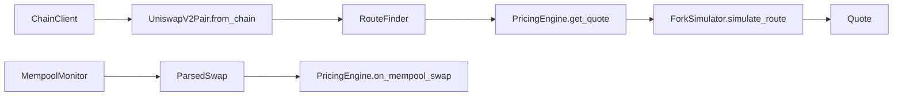

# Peanut Internship - Rust Project

Week 1 introduces the core Ethereum foundation in Rust:
- `core`: addresses, token amounts, deterministic serialization, wallet signing
- `chain`: RPC client, receipt parsing, transaction helpers

### Quick Start
1. `cp .env.example .env`
2. `make run`
3. `make test`
4. `cargo run --bin check_env_and_rpc`

### Environment
- `PRIVATE_KEY`: hex-encoded Ethereum private key for local/testnet use
- `SEPOLIA_RPC_URL`: Sepolia RPC endpoint for integration work
- `MAINNET_RPC_URL`: optional mainnet RPC endpoint for analysis tooling

### Health Check
Run the environment and RPC checker before integration work:

`cargo run --bin check_env_and_rpc`

It verifies:
- wallet key is loadable
- derived wallet address
- Sepolia RPC connectivity, chain id, block height
- balance, pending nonce, and gas snapshot

### Integration Test
Full Sepolia lifecycle test — loads wallet, checks balance, builds a transfer,
estimates gas, signs, verifies signature locally, sends to testnet,
waits for confirmation, and analyzes the receipt:

```sh
cargo run --bin integration_test
```

Required env vars: `PRIVATE_KEY`, `SEPOLIA_RPC_URL`.
The wallet must hold at least **0.001 Sepolia ETH** (use https://sepoliafaucet.com).

### Analyzer CLI
Analyze any Ethereum transaction hash:

```sh
# text output (default)
cargo run --bin analyzer -- <tx_hash> --rpc <url>

# JSON output for programmatic use
cargo run --bin analyzer -- <tx_hash> --format json

# or rely on MAINNET_RPC_URL from .env
cargo run --bin analyzer -- <tx_hash>
```

Features:
- Decodes ERC-20 (`transfer`, `approve`, `transferFrom`) and Uniswap V2/V3 function calls
- Parses event logs (Transfer, Swap, Sync events)
- Shows revert reason for failed transactions
- Supports `--format json` for programmatic output
```

### Generating Documentation
The project is fully documented using `rustdoc`. You can generate and view the technical documentation (including all core types and chain logic) locally:

```sh
# Generate and open documentation for the project and all its dependencies
cargo doc --open

# Generate documentation for this crate ONLY (much faster)
cargo doc --no-deps --open
```

### Repository Architecture
- `src/core/`: Base types (Address, TokenAmount, Token), WalletManager, CanonicalSerializer
- `src/chain/`: ChainClient (RPC + retry), TransactionBuilder, TransactionAnalyzer
- `src/pricing/`: AMM math, router, mempool monitor, fork simulator, and pricing engine
- `src/bin/`: CLI binaries (analyzer, check_env_and_rpc, integration_test)
- `tests/`: Unit and integration tests
- `scripts/`: Automation scripts
- `configs/`: Non-secret configuration
- `docs/`: Module technical guides

### Week 2 Pricing Architecture



### Fork Setup (Anvil)

```sh
ETH_RPC_URL=https://your-rpc.example ./scripts/start_fork.sh
```

### PricingEngine Example

```rust
use peanut_internship_rust::{Address, ChainClient, PricingEngine, Token};

#[tokio::main]
async fn main() -> Result<(), Box<dyn std::error::Error>> {
    let client = ChainClient::new(vec!["http://127.0.0.1:8545".into()], 10, 1);
    let mut engine = PricingEngine::new(
        client,
        "http://127.0.0.1:8545",
        "ws://127.0.0.1:8545",
    )?;

    let pools = vec![
        Address::new("0xB4e16d0168e52d35CaCD2c6185b44281Ec28C9Dc")?,
        Address::new("0x0d4a11d5EEaaC28EC3F61d100daF4d40471f1852")?,
    ];
    engine.load_pools(&pools).await?;

    let weth = Token {
        address: Address::new("0xC02aaA39b223FE8D0A0e5C4F27eAD9083C756Cc2")?,
        symbol: "WETH".into(),
        decimals: 18,
    };
    let usdc = Token {
        address: Address::new("0xA0b86991c6218b36c1d19D4a2e9Eb0cE3606eB48")?,
        symbol: "USDC".into(),
        decimals: 6,
    };

    let quote = engine
        .get_quote(
            &weth,
            &usdc,
            1_000_000_000_000_000_000,
            25,
            Address::new("0x00000000000000000000000000000000000000aa")?,
        )
        .await?;

    println!("Quote valid: {}", quote.is_valid());
    println!("Expected out: {}", quote.expected_output);
    println!("Simulated out: {}", quote.simulated_output);
    Ok(())
}
```

### Running Tests

```sh
# all tests
make test

# specific test suites
cargo test --test unit_core         # base types + serializer + wallet
cargo test --test unit_analyzer     # analyzer selectors, events, errors
cargo test --test unit_client       # RPC error classification + retry
cargo test --test unit_builder      # transaction builder
cargo test --test integration_wallet_security  # keyfile + signing security
```
