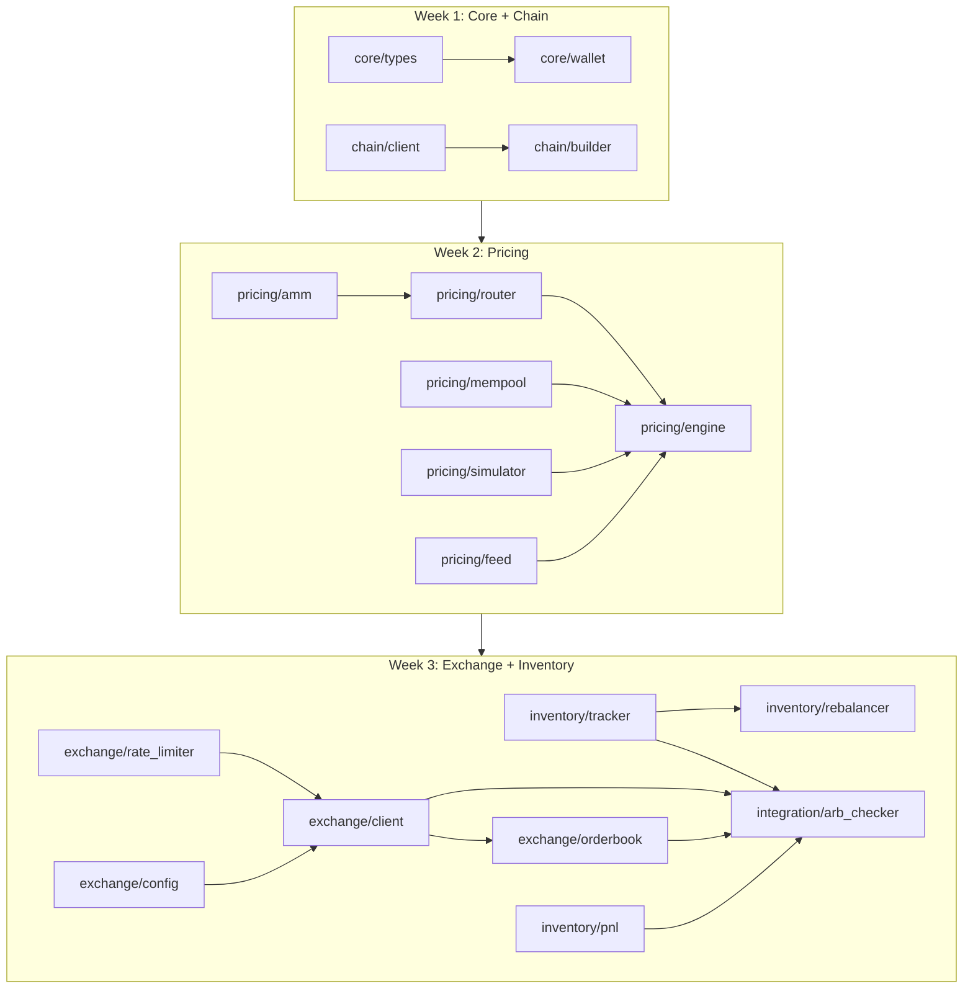
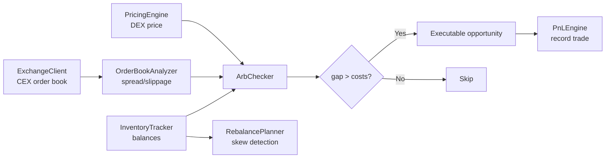

# Peanut Internship - Rust Project

An arbitrage detection and execution system spanning DEX (Uniswap) and CEX (Binance) venues, built entirely in Rust.

### Quick Start
1. `cp .env.example .env`
2. Fill in API keys in `.env`
3. `make run`
4. `make test`

### Environment
- `PRIVATE_KEY`: hex-encoded Ethereum private key for local/testnet use
- `SEPOLIA_RPC_URL`: Sepolia RPC endpoint for integration work
- `MAINNET_RPC_URL`: optional mainnet RPC endpoint for analysis tooling
- `BINANCE_TESTNET_API_KEY`: Binance testnet API key (Week 3)
- `BINANCE_TESTNET_SECRET`: Binance testnet API secret (Week 3)

### Health Check
Run the environment and RPC checker before integration work:

`cargo run --bin check_env_and_rpc`

It verifies:
- wallet key is loadable
- derived wallet address
- Sepolia RPC connectivity, chain id, block height
- balance, pending nonce, and gas snapshot

### Integration Test
Full Sepolia lifecycle test — loads wallet, checks balance, builds a transfer,
estimates gas, signs, verifies signature locally, sends to testnet,
waits for confirmation, and analyzes the receipt:

```sh
cargo run --bin integration_test
```

Required env vars: `PRIVATE_KEY`, `SEPOLIA_RPC_URL`.
The wallet must hold at least **0.001 Sepolia ETH** (use https://sepoliafaucet.com).

### Analyzer CLI
Analyze any Ethereum transaction hash:

```sh
cargo run --bin analyzer -- <tx_hash> --rpc <url>
cargo run --bin analyzer -- <tx_hash> --format json
```

### Week 3: Exchange & Inventory CLIs

```sh
# Fetch and analyze order book
cargo run --bin orderbook_cli -- ETH/USDT --depth 20

# Check inventory skew and rebalance plans
cargo run --bin rebalancer_cli -- check
cargo run --bin rebalancer_cli -- plan ETH

# PnL summary dashboard
cargo run --bin pnl_cli

# End-to-end arbitrage check
cargo run --bin arb_checker_cli -- ETH/USDT --size 2.0
```

### Architecture



Data flow for arbitrage checking:


### Repository Architecture
- `src/core/`: Base types (Address, TokenAmount, Token), WalletManager, CanonicalSerializer
- `src/chain/`: ChainClient (RPC + retry), TransactionBuilder, TransactionAnalyzer
- `src/pricing/`: AMM math, router, mempool monitor, fork simulator, and pricing engine
- `src/exchange/`: Binance testnet client, order book analyzer, rate limiter
- `src/inventory/`: Position tracker, rebalance planner, PnL engine
- `src/integration/`: ArbChecker — end-to-end arbitrage pipeline
- `src/bin/`: CLI binaries
- `tests/`: Unit and integration tests
- `scripts/`: Automation scripts
- `configs/`: Non-secret configuration
- `docs/`: Module technical guides

### Module Details

#### exchange/
| File | Purpose |
|------|---------|
| `config.rs` | Binance testnet config from env vars |
| `client.rs` | REST API client (order book, balance, orders, fees) |
| `orderbook.rs` | Walk-the-book, depth analysis, spread, imbalance |
| `rate_limiter.rs` | Token-bucket rate limiter (1200 weight/min) |
| `types.rs` | OrderBookSnapshot, OrderResult, NormalizedBalance, etc. |
| `errors.rs` | ExchangeError enum |

#### inventory/
| File | Purpose |
|------|---------|
| `tracker.rs` | Multi-venue position tracking, can_execute, skew detection |
| `rebalancer.rs` | Threshold-based rebalance planning with fee accounting |
| `pnl.rs` | Per-trade and aggregate PnL tracking, CSV export |
| `types.rs` | Venue enum, TransferPlan, fee constants |
| `errors.rs` | InventoryError enum |

#### integration/
| File | Purpose |
|------|---------|
| `arb_checker.rs` | End-to-end arb check: DEX price + CEX book + inventory + costs |

### Generating Documentation

```sh
cargo doc --no-deps --open
```

### PricingEngine Example

```rust
use peanut_internship_rust::{Address, ChainClient, PricingEngine, Token};

#[tokio::main]
async fn main() -> Result<(), Box<dyn std::error::Error>> {
    let client = ChainClient::new(vec!["http://127.0.0.1:8545".into()], 10, 1);
    let mut engine = PricingEngine::new(
        client,
        "http://127.0.0.1:8545",
        "ws://127.0.0.1:8545",
    )?;

    let pools = vec![
        Address::new("0xB4e16d0168e52d35CaCD2c6185b44281Ec28C9Dc")?,
        Address::new("0x0d4a11d5EEaaC28EC3F61d100daF4d40471f1852")?,
    ];
    engine.load_pools(&pools).await?;

    let weth = Token {
        address: Address::new("0xC02aaA39b223FE8D0A0e5C4F27eAD9083C756Cc2")?,
        symbol: "WETH".into(),
        decimals: 18,
    };
    let usdc = Token {
        address: Address::new("0xA0b86991c6218b36c1d19D4a2e9Eb0cE3606eB48")?,
        symbol: "USDC".into(),
        decimals: 6,
    };

    let quote = engine
        .get_quote(
            &weth,
            &usdc,
            1_000_000_000_000_000_000,
            25,
            Address::new("0x00000000000000000000000000000000000000aa")?,
        )
        .await?;

    println!("Quote valid: {}", quote.is_valid());
    println!("Expected out: {}", quote.expected_output);
    println!("Simulated out: {}", quote.simulated_output);
    Ok(())
}
```

### Running Tests

```sh
# all tests
make test

# specific test suites
cargo test --test unit_core
cargo test --test unit_analyzer
cargo test --test unit_client
cargo test --test unit_builder
cargo test --test integration_wallet_security
cargo test --test integration_arb_flow   # Week 3 integration tests
```

### Test Coverage

Week 3 modules include **52 tests** covering:
- Order book parsing, sort order, spread calculation
- Walk-the-book with various sizes (exact, multi-level, insufficient liquidity)
- Rate limiter blocking when exhausted
- Inventory update after trades (buy/sell/fee deductions)
- Skew calculation with various distributions
- Rebalance plan generation with fee accounting and min balances
- PnL calculation (gross, net, bps, win rate, CSV export)
- Integration: profitable arb accepted, unprofitable rejected, inventory validation
